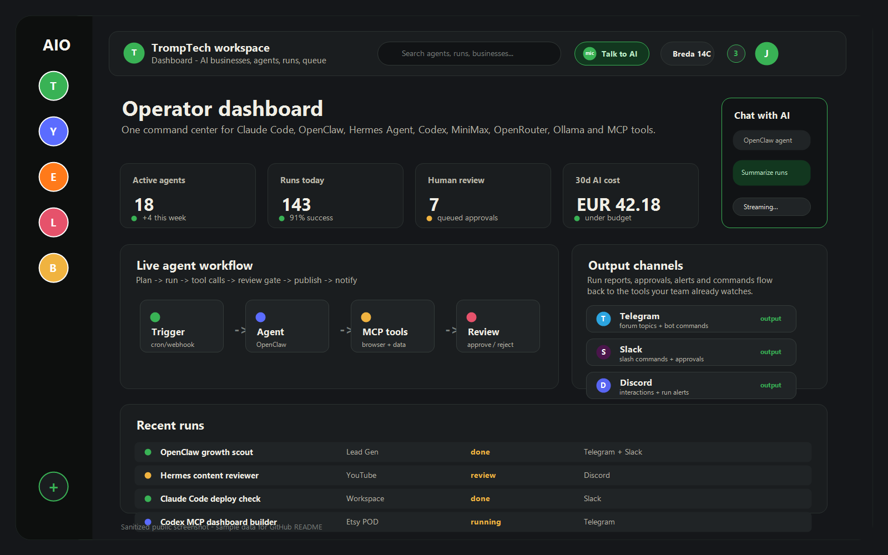
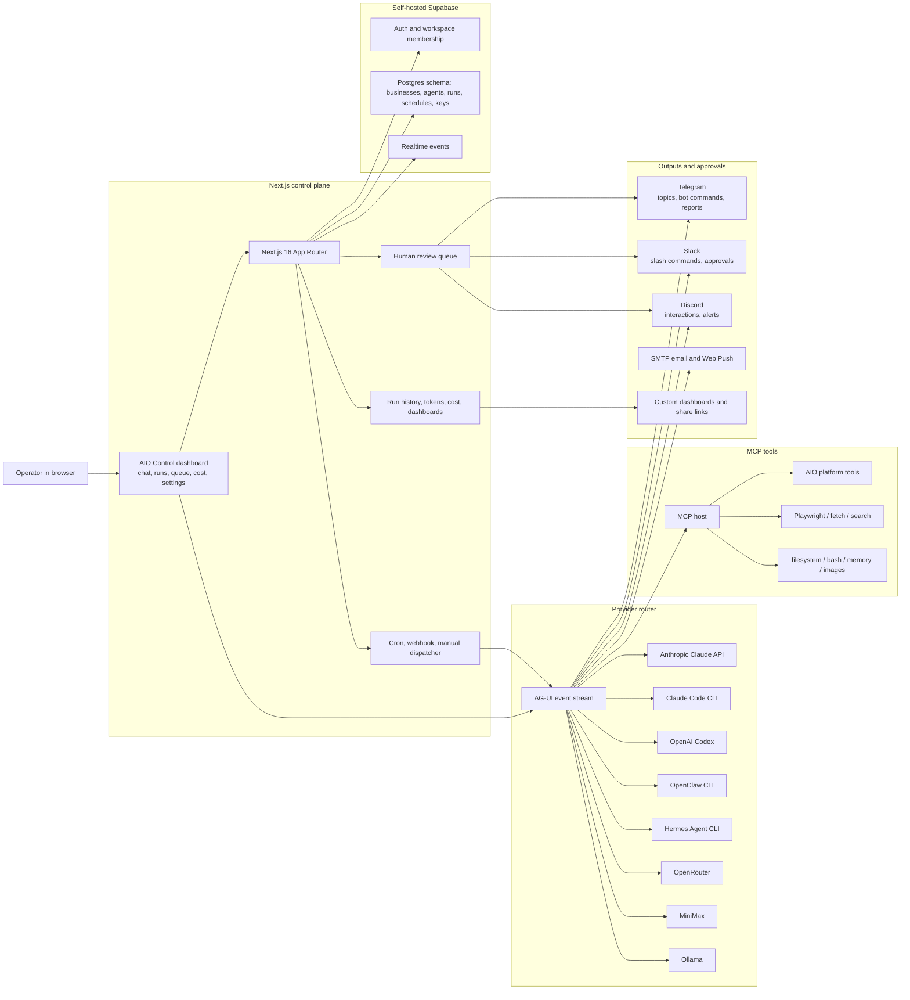

# AIO Control

Self-hosted AI agent command center for OpenClaw, Hermes Agent, Claude Code, OpenAI Codex, OpenRouter, MiniMax, Ollama, Anthropic Claude, and MCP tools.

AIO Control is a Next.js and Supabase control panel for running many AI agents, automations, and small business workflows from one workspace. It gives operators a single dashboard for provider setup, agent chat, scheduled runs, webhooks, human review, notifications, cost tracking, and multi-business automation.

If you are looking for an OpenClaw dashboard, Hermes Agent web UI, Claude Code web dashboard, OpenAI Codex agent console, MCP server dashboard, or self-hosted AI agent platform, this project is meant to sit in that space.

Production:

- Subdomain build: `https://aio.tromptech.life`
- Path build: `https://tromptech.life/aio`
- Public docs: `https://aio.tromptech.life/docs`
- Repository: `https://github.com/lolJeremyFTW/AIO-Control`



## Contents

- [What It Is](#what-it-is)
- [Why It Exists](#why-it-exists)
- [Supported Providers](#supported-providers)
- [Core Features](#core-features)
- [Architecture](#architecture)
- [Repository Layout](#repository-layout)
- [Local Development](#local-development)
- [Environment Variables](#environment-variables)
- [Deployment](#deployment)
- [Database And Migrations](#database-and-migrations)
- [MCP Tools](#mcp-tools)
- [Security Model](#security-model)
- [SEO Keywords And GitHub Topics](#seo-keywords-and-github-topics)
- [Project Status](#project-status)

## What It Is

AIO Control is an AI operations dashboard for people running more than one agent, provider, business, or automation loop.

It is built for a practical workflow:

1. Create a workspace.
2. Add businesses or projects.
3. Create agents with providers such as OpenClaw, Hermes Agent, Claude Code, OpenAI Codex, OpenRouter, MiniMax, Ollama, or Anthropic Claude.
4. Attach tools through MCP and AIO Control's own tool registry.
5. Chat with agents in the browser or run them from cron, webhook, or manual triggers.
6. Review uncertain actions through a human-in-the-loop queue.
7. Track run history, cost, notifications, dashboards, and improvements.

The goal is not to be another one-off chat UI. AIO Control is an operator console for persistent agents that know about workspaces, businesses, topics, schedules, budgets, tools, and previous runs.

## Why It Exists

Most agent runtimes are powerful, but each one usually has its own CLI, auth model, session storage, config files, and operational quirks. AIO Control wraps those runtimes in a single web app so a solo operator or small team can run AI work with a little more discipline.

Use it when you want:

- One web dashboard for OpenClaw, Hermes Agent, Claude Code, OpenAI Codex, OpenRouter, MiniMax, Ollama, and Anthropic Claude agents.
- A self-hosted AI agent platform that runs on your own VPS.
- Multi-business or multi-project organization instead of one flat pile of agents.
- Cron, webhook, and manual agent runs with persistent run history.
- Human approval before risky or uncertain actions.
- Provider key scoping by workspace, business, or topic.
- MCP tools for search, browser automation, filesystem access, local shell, image generation, memory, and internal AIO data.
- Cost dashboards, spend limits, notifications, and audit logs around agent activity.

## Supported Providers

| Provider / runtime      | How AIO Control uses it                                                            | Good for                                                                     |
| ----------------------- | ---------------------------------------------------------------------------------- | ---------------------------------------------------------------------------- |
| Anthropic Claude API    | Direct streaming provider through `@anthropic-ai/sdk`                              | Production Claude agents, tool use, paid API workflows                       |
| Claude Code CLI         | Spawns the local `claude` binary in print / stream-json mode                       | Claude Code subscription workflows, local CLI-based agents                   |
| OpenAI Codex            | Uses a ChatGPT / Codex OAuth token and streams responses                           | Codex-style coding agents and MCP-backed tool loops                          |
| OpenClaw                | Spawns `openclaw agent` as a subprocess with session IDs and optional named agents | OpenClaw agent dashboard, OpenClaw CLI automation, local agent sessions      |
| Hermes Agent            | Spawns `hermes chat` or a named Hermes profile                                     | Hermes Agent web UI, persistent Hermes profiles, SOUL/state-backed workflows |
| OpenRouter              | Streams through the OpenRouter chat completions API                                | Multi-model routing and hosted model choice                                  |
| MiniMax                 | Streams MiniMax chat and supports native MCP tool loops                            | MiniMax Coder Plan, search, image understanding, lower-cost agent work       |
| Ollama                  | Talks to a configured Ollama endpoint                                              | Local LLMs and private/self-hosted model runs                                |
| Generic HTTP foundation | Provider abstraction kept for custom endpoints                                     | Future local or private model endpoints                                      |

Provider IDs in the code include `claude`, `claude_cli`, `openai_codex`, `openclaw`, `hermes`, `openrouter`, `minimax`, `ollama`, and `codex`.

## Core Features

- Multi-workspace auth with Supabase Auth and row-level security.
- Business containers for projects such as lead generation, content, stores, services, or internal automation.
- Topic and nav-node trees for deeper business workflows.
- Workspace-global and business-scoped agents.
- Agent kinds for chat, worker, reviewer, generator, and router roles.
- Smart routing rules that can switch provider and model based on message length, keywords, or conversation depth.
- AG-UI-style streaming events for chat, tool calls, run updates, and errors.
- Cron, webhook, and manual schedules.
- Hybrid scheduler: local `node-cron` runs on the VPS, while Claude subscription agents can route to Claude Routines.
- Persistent run history with token usage, cost, status, retries, and failure visibility.
- Human-in-the-loop queue for approvals, rejections, and review learnings.
- Agent chains for follow-up runs after success or failure.
- API key resolution by topic, business, workspace, then environment fallback.
- Spend limits and cost dashboards by provider, business, and agent.
- Marketplace and admin views for reusable agent presets.
- Notification targets for Telegram, Slack, Discord, SMTP email, and Web Push.
- Telegram forum-topic automation for business and topic reporting.
- Slack slash command and Discord command support.
- Custom HTTP integrations and per-run notifications.
- OpenClaw named runtime agents at workspace and business level.
- Hermes named profiles at workspace level.
- Ollama endpoint setup and model scanning.
- MCP server catalog and per-agent MCP permissions.
- Server file browser, activity feed, global search, profile, team settings, and localization.
- Self-improvement backlog for proposed, approved, built, and rejected improvements.

## Architecture



Main stack:

| Layer             | Choice                                                          |
| ----------------- | --------------------------------------------------------------- |
| Monorepo          | Turborepo and pnpm workspaces                                   |
| Web app           | Next.js 16 App Router, React 19, TypeScript 5.9                 |
| Database and auth | Self-hosted Supabase, Postgres, Auth, Realtime                  |
| Schema            | SQL migrations plus Drizzle schema helpers                      |
| Agent streaming   | AG-UI event format                                              |
| Scheduling        | `node-cron`, webhooks, manual triggers, Claude Routines path    |
| Provider runtime  | TypeScript provider router plus CLI subprocess adapters         |
| Tools             | Native MCP host with local and external MCP servers             |
| Notifications     | Telegram, Slack, Discord, SMTP email, Web Push                  |
| Deployment        | Caddy TLS, Next.js standalone builds, systemd services on a VPS |

## Repository Layout

```text
apps/
  control/                  Next.js control panel and API routes

packages/
  ai/                       Provider router, AG-UI events, MCP host, provider adapters
  db/                       Drizzle schema and Supabase SQL migrations
  ui/                       Shared UI primitives for rail, header, icons, context menus
  eslint-config/            Shared ESLint configuration
  typescript-config/        Shared TypeScript configuration

deploy/
  vps-deploy.sh             Production deploy script for path and subdomain builds
  aio-control.service       systemd unit for the /aio path build on port 3010
  aio-control-root.service  systemd unit for the root/subdomain build on port 3012
  backup-supabase.sh        Supabase/Postgres backup script
  install-cron.sh           Backup cron installer
```

Important app paths:

```text
/                         redirects to the default workspace dashboard
/login, /signup           auth flows
/[workspace]/dashboard    workspace dashboard
/[workspace]/agents       workspace agent calendar and grouped agent list
/[workspace]/flows        AI flow builder
/[workspace]/queue        human review queue
/[workspace]/runs         run history
/[workspace]/cost         spend and usage dashboard
/[workspace]/marketplace  agent preset marketplace
/[workspace]/settings     providers, API keys, MCP tools, channels, email, team, danger zone
/[workspace]/business/[id] business dashboard, agents, schedules, runs, integrations, topics
```

Important API paths:

```text
/api/chat/[agent_id]                    streaming agent chat
/api/runs                               run list and creation
/api/runs/[run_id]/dispatch             internal dispatcher
/api/runs/result                        routine callback
/api/runs/retry-sweep                   retry queue
/api/triggers/[secret]                  webhook trigger
/api/search                             global search
/api/notifications                      notifications
/api/integrations/telegram/webhook      Telegram inbound commands
/api/integrations/slack/commands        Slack slash commands
/api/integrations/slack/interactions    Slack interactivity
/api/integrations/discord/interactions  Discord interactions
/api/providers/[name]/models            provider model discovery
/api/providers/openai-codex/login       OpenAI Codex OAuth start
/api/health                             readiness and runtime pressure check
/api/version                            deployed commit and build metadata
```

## Local Development

Requirements:

- Node.js 18 or newer.
- pnpm 9.
- A Supabase project or local/self-hosted Supabase stack.
- Provider credentials only for the providers you plan to use.

Install and run:

```bash
pnpm install
pnpm dev
```

The control app runs on:

```text
http://localhost:3010
```

Useful scripts:

```bash
pnpm dev
pnpm build
pnpm lint
pnpm check-types
pnpm format
```

## Environment Variables

Minimum app configuration:

```bash
NEXT_PUBLIC_SUPABASE_URL=
NEXT_PUBLIC_SUPABASE_ANON_KEY=
SUPABASE_SERVICE_ROLE_KEY=
DATABASE_URL=
AGENT_SECRET_KEY=
NEXT_PUBLIC_TRIGGER_ORIGIN=http://localhost:3010
```

Common provider configuration:

```bash
ANTHROPIC_API_KEY=
OPENROUTER_API_KEY=
MINIMAX_API_KEY=
MINIMAX_BASE_URL=
MINIMAX_DEFAULT_MODEL=
OLLAMA_BASE_URL=http://localhost:11434
CLAUDE_BIN=claude
OPENCLAW_BIN=openclaw
OPENCLAW_DEFAULT_ARGS=
OPENCLAW_TIMEOUT_MS=120000
HERMES_BIN=hermes
HERMES_DEFAULT_ARGS=
HERMES_TIMEOUT_MS=120000
OPENAI_CODEX_CLIENT_ID=
OPENAI_CODEX_DEFAULT_MODEL=gpt-5.5
OPENAI_CODEX_RESPONSES_URL=
```

Notification and integration configuration:

```bash
TELEGRAM_WEBHOOK_SECRET=
SLACK_BOT_TOKEN=
SLACK_SIGNING_SECRET=
DISCORD_BOT_TOKEN=
DISCORD_PUBLIC_KEY=
SMTP_HOST=
SMTP_PORT=587
SMTP_USER=
SMTP_PASS=
SMTP_FROM=
VAPID_PUBLIC_KEY=
VAPID_PRIVATE_KEY=
VAPID_SUBJECT=
STRIPE_WEBHOOK_SECRET=
MOLLIE_API_KEY=
```

MCP and runtime configuration:

```bash
MCP_SPAWN_CWD=
MCP_FS_ROOT=
MCP_FS_ROOTS=
NPM_GLOBAL_BIN=
MCP_CONNECT_TIMEOUT_MS=30000
MCP_CALL_TIMEOUT_MS=60000
AGENT_MAX_HOPS=150
AIO_SUPABASE_SCHEMA=aio_control
AIO_MCP_ALLOW_READ_SECRET=
BRAVE_API_KEY=
FIRECRAWL_API_KEY=
FIRECRAWL_API_URL=
MEMORY_FILE_PATH=
```

## Deployment

This repository's production deploy is designed for a VPS that runs two standalone Next.js builds:

- Path build at `/aio`, served by `aio-control` on port `3010`.
- Root build for `aio.tromptech.life`, served by `aio-control-root` on port `3012`.

The deploy script:

1. Fetches `origin/main`.
2. Installs dependencies with `pnpm install --frozen-lockfile`.
3. Builds the app twice with different `BASE_PATH` values.
4. Stages each standalone build atomically.
5. Restarts both systemd services.
6. Verifies both health endpoints.

Deploy command used by the local operator:

```bash
ssh vps "cd /home/jeremy/aio-control && bash deploy/vps-deploy.sh"
```

Health checks:

```bash
curl -fsS http://127.0.0.1:3010/aio/api/health
curl -fsS http://127.0.0.1:3012/api/health
```

Version checks:

```bash
curl -fsS http://127.0.0.1:3010/aio/api/version
curl -fsS http://127.0.0.1:3012/api/version
```

## Database And Migrations

The application uses the `aio_control` Postgres schema.

Migrations live in:

```text
packages/db/supabase/migrations/
```

The migration set includes workspaces, profiles, businesses, agents, runs, chat threads, schedules, queue items, API keys, Telegram targets, custom integrations, notification targets, skills, custom tabs, module dashboards, outreach tracking, runtime agent metadata, provider logs, content translations, and self-healing improvements.

The current migration line reaches:

```text
070_improvements_self_healing.sql
```

Apply migrations in order. Most migrations are written to be idempotent with `if not exists` guards where possible.

## MCP Tools

AIO Control includes a native MCP host. Agents can be granted MCP servers by ID, and each agent can have scoped permissions.

Catalog highlights:

| MCP server ID    | Purpose                                                                                                    |
| ---------------- | ---------------------------------------------------------------------------------------------------------- |
| `aio`            | AIO Control platform tools for businesses, agents, runs, schedules, Supabase context, and review learnings |
| `filesystem`     | File read/list/write access inside configured roots                                                        |
| `bash`           | Local shell execution on the runtime host                                                                  |
| `fetch`          | URL fetch with clean text output                                                                           |
| `playwright`     | Headless Chromium browser automation                                                                       |
| `brave`          | Brave Search-backed web and news search                                                                    |
| `memory`         | Persistent memory graph                                                                                    |
| `firecrawl`      | Web scraping, crawling, and research                                                                       |
| `firecrawl-pc`   | Firecrawl routed to a PC host over Tailscale                                                               |
| `minimax`        | MiniMax Coder Plan web search and image understanding                                                      |
| `minimax-images` | MiniMax image generation                                                                                   |
| `openai-images`  | OpenAI image generation through Codex login or API key fallback                                            |

AIO platform tools include read tools such as `list_businesses`, `list_agents`, `list_runs`, `list_schedules`, and `get_supabase_context`; write tools such as `create_business`, `create_agent`, `update_agent`, and `create_schedule`; and meta tools such as `ask_followup`, `todo_set`, `open_ui_at`, `request_human_review`, and `schedule_chat_ping`.

## Security Model

- Supabase row-level security is enabled for user data tables.
- Service-role access stays server-side.
- API keys are resolved by topic, business, workspace, then environment fallback.
- Workspace secrets can be scoped and encrypted.
- Agent write tools are designed to require confirmation unless explicitly auto-approved.
- Human-in-the-loop review items capture uncertainty and risky actions.
- Runtime providers get scoped environment variables for the current workspace, business, topic, agent, schedule, and run.
- The health endpoint checks Supabase readiness and runtime pressure from stale/running/queued runs.

## SEO Keywords And GitHub Topics

This README intentionally uses the exact phrases people search for when comparing self-hosted AI agent tools:

- OpenClaw dashboard
- OpenClaw web UI
- OpenClaw agent control panel
- Hermes Agent dashboard
- Hermes Agent web UI
- hermes-agent control panel
- Claude Code dashboard
- Claude Code web UI
- Claude Code CLI automation
- OpenAI Codex agent console
- Codex MCP dashboard
- MCP server dashboard
- Model Context Protocol tools
- self-hosted AI agent platform
- AI agent command center
- AI agent control panel
- multi-agent orchestration dashboard
- Next.js Supabase AI agents
- Ollama agent dashboard
- OpenRouter agent dashboard
- MiniMax Coder Plan agents

Suggested GitHub repository topics:

```text
ai-agents
agent-dashboard
agent-orchestration
self-hosted
openclaw
hermes-agent
claude-code
openai-codex
mcp
model-context-protocol
nextjs
supabase
ollama
openrouter
minimax
anthropic
ai-automation
human-in-the-loop
ag-ui
```

## Project Status

AIO Control is actively developed for self-hosted VPS use. The core control panel, provider router, schedules, run history, notifications, cost views, MCP host, OpenClaw runtime agents, Hermes profiles, Claude Code CLI provider, OpenAI Codex provider, and production deploy flow are in place.

This is still an operator-focused system, not a polished SaaS template. Expect the repository to keep evolving around real workflows, production incidents, provider changes, and new agent runtimes.

## License

No license file is currently included in this repository.

Third-party product names such as OpenClaw, Hermes Agent, Claude Code, OpenAI Codex, OpenRouter, MiniMax, Ollama, Anthropic Claude, Supabase, and Next.js belong to their respective owners. This repository is not claiming official affiliation unless explicitly stated elsewhere.
